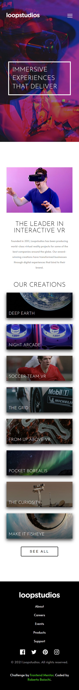

# Frontend Mentor - Loopstudios landing page solution

This is a solution to the [Loopstudios landing page challenge on Frontend Mentor](https://www.frontendmentor.io/challenges/loopstudios-landing-page-N88J5Onjw). Frontend Mentor challenges help you improve your coding skills by building realistic projects. 

## Table of contents

- [Overview](#overview)
  - [The challenge](#the-challenge)
  - [Screenshot](#screenshot)
  - [Links](#links)
- [My process](#my-process)
  - [Built with](#built-with)
  - [What I learned](#what-i-learned)
  - [Continued development](#continued-development)
- [Author](#author)
- [Acknowledgments](#acknowledgments)

## Overview
 It was a cool challenge :)
### The challenge

Users should be able to:

- View the optimal layout for the site depending on their device's screen size
- See hover states for all interactive elements on the page

### Screenshot

### Links

- Live Url : https://robertobaiochi.github.io/FrontEndMentor-loopstation/

### Built with

- Semantic HTML5 markup
- SCSS custom properties
- Flexbox
- Css Grid

### What I learned

It was the first design I could do using React and Sass, it was challenging to understand how it was going to be done, but I think I do well, for now...

### Continued development

Challenge myself more and more to organize everything in a cleaner and more reusable way.

## Author

- Frontend Mentor - [@RobertoBaiochi](https://www.frontendmentor.io/profile/RobertoBaiochi)

## Acknowledgments

I thank the entire community, it's unbelievable the amount of good people I ended up meeting as soon as I started studying, you guys are inspiring and I hope one day I can be too. :D
